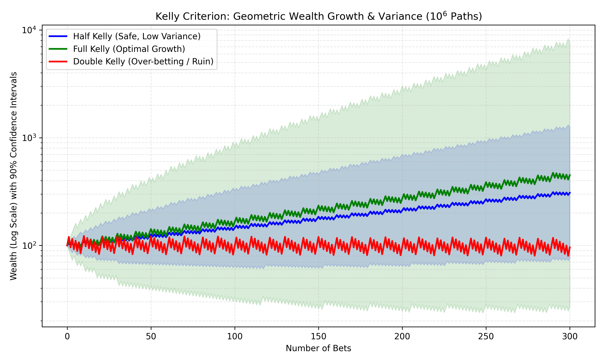

# Optimal Capital Growth & Drawdown Simulator (Kelly Criterion)

A vectorized Monte Carlo simulation modeling geometric wealth growth and asymptotic ruin probabilities across fractional Kelly allocations.

## Mathematical Formulation
The Kelly Criterion maximizes the expected logarithmic growth rate of wealth. For a game with win probability $p$ and payout odds $b$, the expected log-wealth is:

$$ E[\log(W)] = p \log(1 + fb) + (1-p) \log(1 - f) $$

Taking the derivative with respect to $f$ yields the optimal betting fraction:

$$ f^* = \frac{bp - (1-p)}{b} $$

## Simulation Details
Instead of looping over individual paths, this script utilizes `numpy` to vectorize a $10^6 \times 300$ binomial matrix, mapping random variables to wealth multipliers, and calculating cumulative geometric products via `np.cumprod`. This allows for instantaneous evaluation of $10^6$ paths.

## Results & Empirical Drawdowns
The simulation extracts the median and 90% confidence intervals (5th–95th percentiles) to visually map variance and drawdown risk:
1. **Full Kelly ($f^*$):** Maximizes terminal median wealth, but features massive peak-to-trough variance (wide confidence intervals).
2. **Half Kelly ($0.5f^*$):** Drastically tightens the variance bounds and drawdown severity while maintaining positive expected geometric growth.
3. **Double Kelly ($2f^*$):** Pushes the geometric growth rate into negative territory. Despite a strictly positive expected value on individual bets, the median path mathematically converges to capital extinction (ruin).

